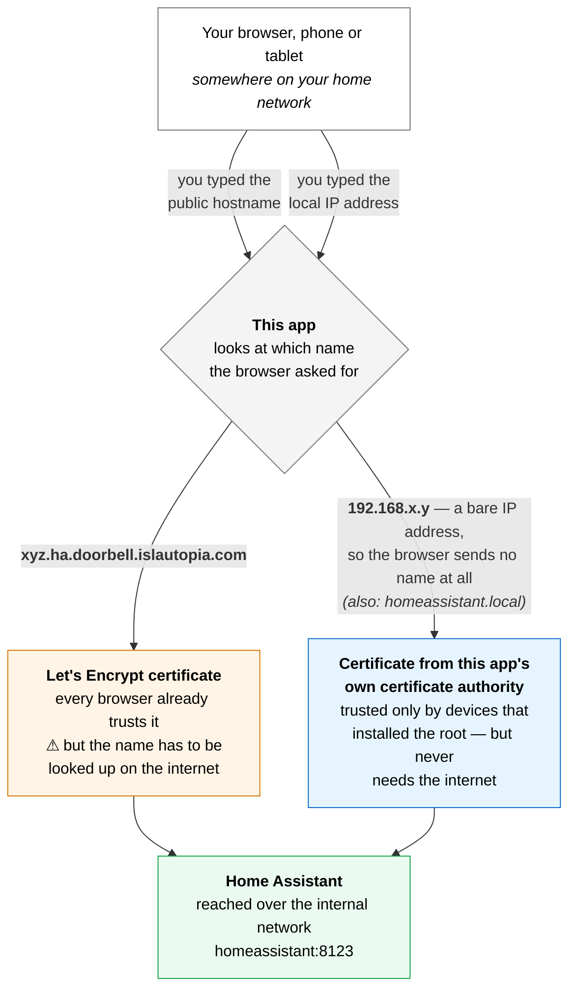
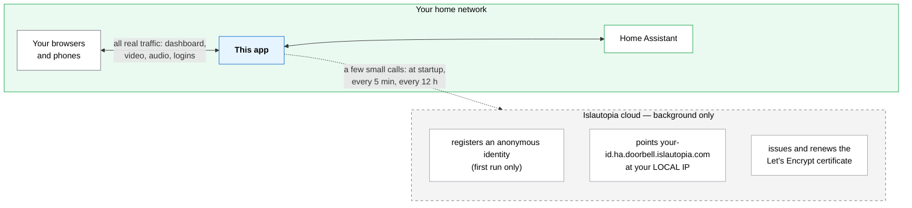

# Islautopia HTTPS for Home Assistant

**Real HTTPS for your whole Home Assistant instance — with or without internet. No domain, no DNS
account, no port forwarding.**

---

> **This is not a Nabu Casa alternative, and it does not compete with it.** This app gives you no
> remote access to Home Assistant whatsoever — the public hostname it uses only ever resolves to
> your **local** IP address, which is unreachable from outside your network by design (see
> "Controlled risks" below). It solves a different, much narrower problem: real HTTPS for your
> **local** access, which two-way audio needs. If you want genuine remote access to your Home
> Assistant, [Nabu Casa](https://www.nabucasa.com/) — or your own remote-access proxy — remains
> the right tool. There is no overlap, and you can run both at once with no conflict.

## 1. What it is

A Home Assistant app that puts real, browser-trusted HTTPS in front of your entire dashboard on
port 8443, and keeps it working when your internet does not.

It does that with **two certificates at the same time**, handing each browser whichever one fits
how that browser arrived:

| You reach Home Assistant at… | Certificate served | Needs internet? | Setup on your devices |
|---|---|---|---|
| `https://<your-id>.ha.doorbell.islautopia.com:8443` | Real Let's Encrypt | Yes, to look the name up | None |
| `https://192.168.x.y:8443` (your local IP) | Issued by this app itself | No, ever | Install one file, once |

The first row is the zero-effort path and works out of the box. The second row is the one that
survives an outage, and it costs about a minute per device. **Use just the first, just the second,
or both.** Nothing about the first row changed to make the second possible.

## 2. What it's for

Browsers only allow microphone access (`getUserMedia()`) from a **secure context** — meaning the
page itself was loaded over HTTPS. Two details make that harder than it sounds:

- **The browser judges the page, not what the page talks to.** Your doorbell can have a perfect
  certificate of its own and it changes nothing, because the page asking for the microphone was
  served by Home Assistant. Home Assistant's own address is what has to be secure.
- **Plain `http://192.168.x.y:8123` is not a secure context**, so on that address the microphone is
  blocked outright, with no way for you to override it.

That is what this app fixes. It was built for the
[Islautopia Intercom Card](https://github.com/Islautopia/islautopia-intercom-card), but nothing
about it is specific to that: **anything** that needs your Home Assistant origin to be secure
benefits, including third-party camera or intercom cards and any integration that calls
`getUserMedia()`. It is shared as general Home Assistant infrastructure.

You never touch a domain registrar, a DNS provider account, or your router's port forwarding. That
is the entire difference from Home Assistant's official "Let's Encrypt" app, which requires you to
own a domain and hold credentials for a supported DNS provider.

## 3. How it works

### The two paths

The choice happens automatically, per connection, in the first instant of the handshake — you never
pick anything. Browsers announce the name they are trying to reach at the very start of a secure
connection, and this app answers with the matching certificate. When you type a bare IP address
there is no name to announce, so the browser sends none, and that case falls through to the local
certificate.

### Where the cloud comes in — and where it doesn't

**The Islautopia cloud is never in the path of your actual Home Assistant traffic.** It is used
only for the occasional background calls shown as a dotted line. Your dashboard, camera streams,
audio and logins go straight from your browser to this app on your own network, and never leave it.

The **local certificate path involves the cloud not at all** — not at setup, not at renewal, not
ever. That is precisely why it keeps working when the internet is down.

### What runs, in order, every time it starts

1. **Local certificate authority** — on the very first run it creates its own small certificate
   authority and stores it privately. A *certificate authority* is simply something whose word a
   device accepts when vouching for other certificates; this one vouches for nothing but this Home
   Assistant. Created once, never regenerated.
2. **Local certificate** — issues itself a certificate covering every local address this host has,
   plus `homeassistant.local` and `localhost`. Reissued automatically if those addresses change or
   as expiry approaches. HTTPS is serving from this point on, with no network involved.
3. **Cloud identity** *(needs internet, allowed to fail)* — registers an anonymous identity and
   remembers it.
4. **DNS** *(needs internet)* — reports this host's local IP so
   `<your-id>.ha.doorbell.islautopia.com` points at it. Rechecked every 5 minutes.
5. **Public certificate** *(needs internet)* — fetches the real Let's Encrypt certificate and
   starts serving it alongside the local one. Rechecked for renewal every 12 hours.

Steps 3 to 5 are best-effort. If any of them fails — no internet, service down, a first install in
a house with no line yet — the app says so in its log and carries on serving the local path,
retrying in the background. **It never refuses to start because the internet is unavailable.**

## 4. Should you install the root certificate?

Honestly: **only if you want two-way audio to survive an internet outage.** That is the entire
benefit. If your connection is reliable and you can live without the doorbell's audio during an
outage, skip it — everything else already works, and you would be adding a step for nothing.

The real cost, stated plainly rather than buried:

- **It is per device.** Every phone, tablet and computer that wants the guarantee needs it. There
  is no way to push it to them all at once.
- **It is a trust decision, not a formality.** You are telling that device to believe certificates
  issued by this Home Assistant. Anyone who obtained the private key from your Home Assistant could
  then impersonate other websites to that device. The key lives in the app's private storage, so
  obtaining it means already having deep access to your Home Assistant host — but the risk is real,
  and better known now than discovered later.
- **iPhone and iPad take two steps, not one.** Installing the profile is not enough: iOS keeps new
  authorities switched off until you enable them under **Settings → General → About → Certificate
  Trust Settings**. Miss it and everything looks installed while nothing works, with no message
  explaining why. The portal spells this out.
- **Firefox keeps its own list**, on every platform, and needs it done separately.

What it does **not** cost you is maintenance. The root is installed once and lasts ten years. The
short-lived certificates it vouches for renew themselves in the background without anyone touching
a device — which is exactly why this app runs an authority instead of one fixed self-signed
certificate.

**How to do it:** open `http://<your-home-assistant-ip>:8099` on the device and follow the page. It
carries per-platform instructions and the fingerprint to check.

## 5. Controlled risks

Read this before installing. These are precise on purpose — please don't skim.

1. **The public hostname always points at your LOCAL IP, never a public one.**
   `<your-id>.ha.doorbell.islautopia.com` resolves to the private address of your Home Assistant
   host on your own network (e.g. `192.168.1.50`). It does **not** make Home Assistant reachable
   from outside, and that is not its purpose — it exists purely to give your browser a name with a
   valid certificate attached. Nobody outside your network can connect to it, even knowing the name.

2. **That name-to-local-IP association is a public DNS record**, like any other. Anyone who knew or
   guessed your instance id (16 random hex characters — practically impossible) could look up the
   *local* address used inside your home. That alone grants no access: reaching it still requires
   being on your network, and then passing your normal Home Assistant login.

3. **The public certificate and its private key are generated on Islautopia's server** and
   delivered over an encrypted connection — the same mechanism already used for Islautopia Doorbell
   hardware. Islautopia's infrastructure briefly handles that key during issuance, as does any
   provider that manages HTTPS on your behalf. If you would rather no key of yours ever left your
   network, use Home Assistant's official **Let's Encrypt** app instead, which requires your own
   domain and DNS provider credentials. The **local** certificate is unaffected by any of this: its
   key is generated on your own machine and never leaves it.

4. **The local certificate authority's private key lives on your Home Assistant host.** It is
   stored with owner-only permissions in the app's private storage, which is not exposed over the
   network and is not the `/config` share. Anyone able to read it could impersonate websites to
   devices that installed the root — but reaching it already requires deep access to the host
   itself. See section 4 for what that means in practice.

5. **The trust portal runs over plain, unencrypted HTTP** (port 8099), deliberately: making you
   click through a certificate warning in order to download the certificate that removes warnings
   would teach exactly the wrong reflex. The consequence is that someone already inside your
   network could tamper with that page. That is why the fingerprint printed in **this app's log**
   is the authoritative one — it reaches you through Home Assistant's own authenticated interface —
   and why the page tells you to compare the two before installing anything. **Please actually
   compare them.**

6. **This does NOT replace Home Assistant's own login.** It adds transport encryption and nothing
   else. Anyone reaching either address still has to log in normally.

7. **Uninstalling is enough to stop using it.** The DNS record simply stops being updated, and your
   normal local access keeps working exactly as before. If you installed the root on your devices
   and want that gone too, remove it through the same settings screen you added it in.

8. **This is not remote access, and isn't trying to be.** See the note at the top.

## 6. Required configuration

**None.** No options, no YAML, no fields to fill in. Unlike a doorbell, a Home Assistant instance
has no factory identity, so there is nothing meaningful to ask you for. Install, start, done.

To be precise rather than imply something untrue: **one step is genuinely yours**, because the app
cannot change your bookmarks or your existing Home Assistant URL setting by itself.

1. Open the **Log** tab after starting. It prints both addresses, plus the fingerprint of the local
   certificate authority.
2. Browse to whichever address you intend to use, at least once. The first request for the public
   certificate can take tens of seconds, because a real issuance happens on Islautopia's server;
   every later start is instant.
3. *(Optional, recommended)* Set that address under **Settings → System → Network → Home Assistant
   URL**, so the rest of Home Assistant — links, notifications, mobile app discovery — uses it
   automatically.
4. *(Optional)* If you want the offline guarantee, open `http://<your-ip>:8099` on each device and
   follow it. See section 4 for whether you need this at all.

## 7. Installation

1. **Add the repository** — **Settings → Apps → App Store → ⋮ → Repositories**, then add
   `https://github.com/Islautopia/ig_hassio_addons`.
2. Find **Islautopia HTTPS for Home Assistant**, click **Install**, then **Start**.
3. Follow section 6 above.

## 8. Troubleshooting

**The app won't start, or the log shows a registration error.**
Check that your Home Assistant host has outbound internet. Note that this alone should no longer
prevent startup — the local path needs no internet, and the log says so explicitly. If it genuinely
refuses to start, that is a bug worth reporting.

**The public hostname doesn't resolve.**
Expected without internet: that name is looked up on the public internet. Use the local IP address
instead. With the root certificate installed it works with no warning; without it, your browser
warns you and the microphone stays blocked.

**Certificate not updating after a router or IP change.**
The app rechecks every 5 minutes and reissues the local certificate automatically. Give it a few
minutes, or restart the app to force an immediate check.

**My browser still warns me on the local IP address.**
The root isn't trusted on that device yet. On iPhone or iPad this is almost always the second iOS
step — **Settings → General → About → Certificate Trust Settings** — which is easy to miss. Firefox
ignores the operating system's list entirely and needs it imported separately.

**The browser still blocks the microphone.**
Confirm the address bar shows `https://` with no warning. A page loaded over plain `http://`, or
over HTTPS your browser doesn't trust, cannot be granted the microphone at all.

---

**Developed by Islautopia Garage.**
*Questions or partnership inquiries: [garage@islautopia.com](mailto:garage@islautopia.com)*
